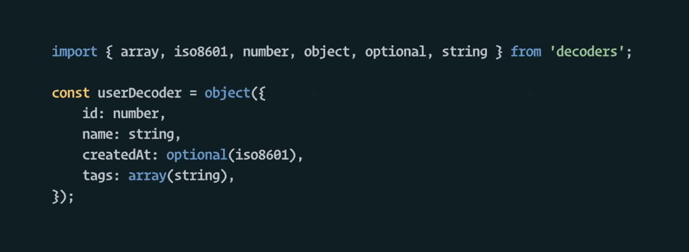

<div style="margin: 0 0 30px 0; padding: 0px 20px; background: #fff8c5; border: 1px solid rgba(212,167,44,0.4); border-radius: 8px; font-size: 1.2em;">
  <p>You're looking at the documentation for decoders <b>v2.x</b>, which is still in beta!<br />
    You can find <a href="https://github.com/nvie/decoders/tree/v1.25.5#readme">the old 1.x docs</a> here, or read the
    <a href="https://github.com/nvie/decoders/blob/main/MIGRATING-v2.md">migration instructions</a>.
  </p>
</div>

<!-- prettier-ignore-start -->
# Validate untrusted inputs
{: .fs-8 .fw-400 }
<!-- prettier-ignore-end -->

<!-- prettier-ignore-start -->
Decoders is an elegant and battle-tested validation library for type-safe input data for
[TypeScript](https://www.typescriptlang.org/) and [Flow](https://flow.org/).
{: .fs-6 .fw-300 }
<!-- prettier-ignore-end -->

[Get started now](#getting-started){: .btn .btn-primary .fs-6 .mb-4 .mb-md-0 .mr-4 .px-5
.py-3 } [Decoder API](https://decoders.cc/Decoder.html){: .btn .fs-6 .mb-4 .mb-md-0 .mr-4
.px-5 .py-3 } [API Reference](https://decoders.cc/api.html){: .btn .fs-6 .mb-4 .mb-md-0
.px-5 .py-3 }

## Getting started

Just install the package and you're ready to go.

    $ npm install decoders

## Motivation

Data entering your application from the outside world should not be trusted without
validation and often is of the `any` type, effectively disabling your type checker around
input values. It's an industry good practice to validate your expectations right at your
program's boundaries. This has two benefits: (1) your inputs are getting validated, and
(2) you can now statically know for sure the shape of the incoming data. **Decoders help
solve both of these problems at once.**

## The core idea

The central concept of this library is the Decoder. A `Decoder<T>` has a validation
function that, when called on an untrusted input, will either return an "ok" result with
the decoded value of type `T` as its payload, or an "error" result.

This way, you can be sure that all untrusted runtime data is always in the shape you
expect, and that static types can correctly be inferred for dynamic input data.

There are roughly two ways to use a `Decoder<T>` instance:

-   `.verify()` (for convenience)
-   `.decode()` (for programmatically handling the success)

The simplest API is `.verify()`. It will either return the decoded (safe) value on
success, or throw an error with a friendly message when the decoding failed.


Alternatively, you can use the lower-level `.decode()` method if you want to have more
programmatic control over the result. It works like `.verify()`, but instead of directly
returning a value or failing, it returns a "Result" value, which can either have
`ok: true` (and a value), or `ok: false` and an error annotation.


This makes it easier to use in `if`-statements, or to fall back to a default value if you
want to allow graceful failure. For example, you can use it as follows:

```typescript
// Best-effort attempt to decode, but fall back to 0 if externalData is not
// a valid positive number.
positiveNumber.decode(externalData).value ?? 0;

// 42    => 42
// -1    => 0
// 'lol' => 0
```

## Understanding the "type" of a Decoder

Every decoder has a type, for example when you see a decoder of type `Decoder<string>` it
means that _if_ it accepts the runtime input, it will always return a `string`.

It does **not** mean it will only accept string inputs! Take the `truthy` decoder as an
example. That one will accept _any_ input value, but return a `boolean`. What values will
get accepted by a decoder depends on its implementation. The decoder's documentation will
tell you what inputs it accepts.

## Composing decoders

Decoders can be stacked together like LEGO® pieces to build larger decoders. For example,
here you can see how four decoders can be combined to build a larger decoder:



## Example

Suppose, for example, you have a webhook endpoint that will receive user payloads:

```typescript
import { array, iso8601, number, object, optional, string } from 'decoders';

// External data, for example JSON.parse()'ed from a request payload
const externalData = {
    id: 123,
    name: 'Alison Roberts',
    createdAt: '1994-01-11T12:26:37.024Z',
    tags: ['foo', 'bar', 'qux'],
};

const userDecoder = object({
    id: number,
    name: string,
    createdAt: optional(iso8601),
    tags: array(string),
});

// NOTE: TypeScript will automatically infer this type for the `user` variable
// interface User {
//     id: number;
//     name: string;
//     createdAt?: Date;
//     tags: string[];
// }

const user = userDecoder.verify(externalData);
```

## Building your own decoders

You are encouraged to build your own decoders that serve your use case. For documentation
and examples, see [Building your own](/building-your-own.md).

<!--

## Formatting error messsages

By default, `.verify()` will use the `formatInline` error formatter. You can pass another
built-in formatter as the second argument, or provide your own. (This will require
understanding the internal `Annotation` datastructure that decoders uses for error
reporting.)

Built-in formatters are:

-   `formatInline` (default) — will echo back the input object and inline error messages
    smartly. Example:

    ```typescript
    import { array, object, string } from 'decoders';
    import { formatInline } from 'decoders/format';

    const mydecoder = array(object({ name: string, age: number }));

    const externalData = [{ name: 'Alice', age: '33' }];
    mydecoder.verify(externalData, formatInline);
    ```

    Will throw the following error message:

    ```text
    Decoding error:
    [
      {
        name: 'Alice',
        age: '33',
             ^^^^ Must be number
      },
    ]
    ```

-   `formatShort` — will report the _path_ into the object where the error happened.
    Example:

    ```typescript
    import { formatShort } from 'decoders/format';
    mydecoder.verify(externalData, formatShort);
    ```

    Will throw the following error message:

    ```text
    Decoding error: Value at keypath 0.age: Must be number
    ```

-->
